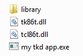
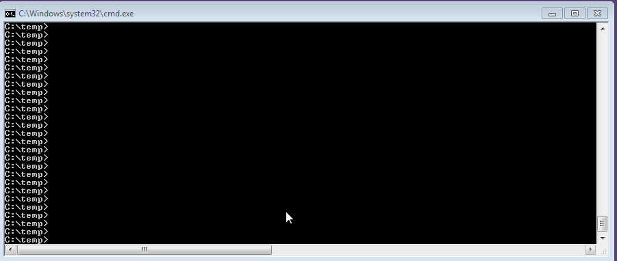

Bin2D
=====

A tool that enables files to be compiled into an executable and extracted at startup.

## Features:

- Limit generated code by:
	- package modifier
	- ``version(unittest)``
- Use enum for usage at compile time, instead of ``const(ubyte[])``
- Optionally specify module name
- Automatic finding of files under directories
- Output compiled in files at runtime to a specified directory or temporary directory

## Basic usage:
Basic usage is as follows
```Bin2D <output file>[=<module name>] <files or directories...>```

**Example**
I have a tkd project that I want to pack up.
I need some files and some dll's for it to work.

Folder of needed stuff:



I added the Bin2d.exe to my path for convience.



```Bin2D MODULE.d=Resource_Reference library tk86t.dll tcl86t.dll "my tkd app.exe" ```

I created this file and added to my C:\temp folder.
```D
import std.stdio;
import std.process;
import PKG = Resource_Reference;

void main() {
    string[string] FILE_LOCATIONS = PKG.outputFilesToFileSystem();
    
    foreach(string key; PKG.originalNames){
          writeln("extracting: ", key , " : " , FILE_LOCATIONS[key] );
    }
    execute(FILE_LOCATIONS["my tkd app.exe"]);
    PKG.cleanup();
}
```

I compiled with
```dmd MAIN.d MODULE.d```
If you want to do what I did with a gui app you might want to link to windows:subsystem.
## But what if I don't know the name at compile time?
To get access to *all* the values with names you need to iterate over two seperate arrays.
The first ``names`` will give you the mangled names. The second ``values`` will give you the values based upon the index in assetNames.

## So how do you extract?

This will extract any files given to it. With specific output directory.
It returns an array of the file systems names with the original extension. Directories have been encoded away however.
```D
import modulename;
outputFilesToFileSystem("output/stored/here");
```

**And for a temporary directories?**
```D
import modulename;
outputFilesToFileSystem();
```
It does return the same result as output outputBin2D2FS(string) does.

## Why not string mixins?
- String mixins at least on Windows are bugged. They cannot use subdirectories.
- Assets do not change often so regeneration process can be manual
- Easy export to file system
